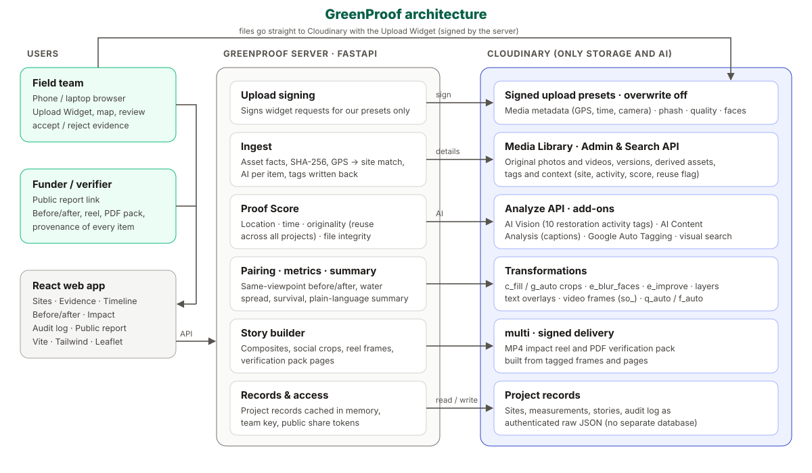

# GreenProof

[](https://cloudinary.com/)
[](LICENSE)

**Verification-ready evidence for lake revival and plantation projects.**

Field teams upload photos and videos; Cloudinary's AI describes every item. GreenProof checks where and when each one was taken and whether it was reused from another project, organises everything by project, site and timeline, and turns it into before/after comparisons, impact numbers, a reel and a verification pack that a funder opens from one link.

Code Cubicle 6.0 · Problem Statement 02 (Cloudinary): *AI-Powered Impact & Sustainability Media Platform*

**Live:** [greenproof-362605925833.asia-south1.run.app](https://greenproof-362605925833.asia-south1.run.app) (Google Cloud Run).

## The problem

India funds water-body revival and tree planting at scale, and pays out against photo evidence:

- **Mission Amrit Sarovar** set out to revive 75 water bodies in every district; over 68,000 were completed by March 2025. Each one is geotagged in three photo phases (before, during and after work) [1].
- The **Green Credit Programme** awards credits only after 5 years, one per **surviving** tree on land with more than 40% canopy, after third-party verification. Every land parcel is registered with geotagged photographs and a single-polygon `.kml` boundary; non-geotagged photos are a common reason submissions fail [2][3].
- Companies spent **₹3,397 crore of CSR money on environmental sustainability** in FY 2024-25 [4].

The evidence behind this money is weak:

- **Photos get reused.** Under MGNREGA's photo-based monitoring, supervisors used old photos or the same photo again and again; Rajasthan found about 13 crore fake workdays (over ₹2,600 crore) between November 2024 and June 2025 [5].
- **Location and time get lost.** WhatsApp, the usual way field photos travel, strips GPS and time from the photos it sends [6].
- **Survival is rarely re-checked.** A CAG audit of Odisha's compensatory afforestation found only 7.5% of plantations raised in 2016-17 to 2019-20 survived [7].
- **Funders get a PDF of pictures**, with no way to trace an image to the original file or see what changed.

Satellite imagery does not close the gap for small sites: a 10 m pixel cannot see a sapling or a village pond. For these projects, ground photos are the evidence, so they have to be trustworthy.

## What it does

1. **Map the site.** Create a project, find the lake or plot on a satellite map and outline it. Download the boundary as KML.
2. **Upload evidence.** Field workers upload photos and videos from a phone or laptop with the Cloudinary Upload Widget. Files can never be overwritten.
3. **Understand it.** Cloudinary AI captions each item and labels restoration activities: dry lakebed, water-filled lake, desilting work, bund or embankment work, weeds or waste in water, saplings planted, established trees, dead or dry saplings, people working, project signboard. Videos are checked at the start, middle and end.
4. **Review it.** Every item gets a **Proof Score** with reasons (below). Items that look reused, were taken off-site or were edited are flagged for the team to accept or reject. Weak items stay out of the public report until accepted. Evidence is never deleted through the app.
5. **Organise and find it.** By project, by site (GPS matched to the boundary) and on a monthly timeline. Search in plain words ("dry lakebed with cracks") with filters for site, activity, proof grade and media type.
6. **Compare.** Photos taken at least two weeks apart are paired into a before/after slider, preferring nearby GPS positions and similar compass directions. The team can also choose a pair.
7. **Measure.** Record water spread per date (drawn on the map, in hectares) and sapling survival per survey (planted vs alive).
8. **Tell the story.** A plain-language summary written from the data, and one click for a before/after image per site, a 9:16 reel, a verification pack PDF (up to 28 photos with scores and flag reasons) and social crops.
9. **Share and trace.** A public report link for the funder, with face blur applied to photos. Each item shows its original Cloudinary public ID and version, available hashes, outputs made from it and an audit history of app changes.

A "next steps" strip on each project shows what is left: outline the site, upload, review flagged items, record measurements, share the story.

## Problem statement coverage

| PS02 goal (official brief) | GreenProof |
|---|---|
| Understand field media; organise evidence by project, location and timeline | AI captions, tags and activities; project → site by GPS on a map; monthly timeline |
| Analyse and intelligently organise large collections of image and video evidence | Multi-file uploads and Media Library sync; automatic site assignment; Cloudinary tags per site, activity and flag |
| Identify relevant projects, activities, locations and visual signals | Ten restoration activity labels (AI Vision), captions, tags, GPS → site, faces, quality, reuse flag |
| Compare before-and-after media to show visible change | Automatic pairing from the same viewpoint; slider and shareable composite; water spread and survival over time |
| Generate visual reports, summaries and campaign-ready content | Public report, written summary, reel (MP4), verification pack (PDF), 1:1 / 9:16 / 1.91:1 social crops |
| Make media searchable through AI metadata, tagging and semantic discovery | Plain-language search over captions, tags and activities, plus Cloudinary visual search |
| Preserve traceability to original source assets and transformations | Provenance panel per item, Cloudinary derived-asset list, audit log |
| Expected outcome: searchable evidence, measurable impact, compelling stories | Proof Score and reuse detection; water spread and survival; reel, composites and report |

## Proof Score

| Check | Points | Full marks when | Flags |
|---|---|---|---|
| Location | 30 | Photo GPS is inside the site boundary (within 30 m, the accuracy of a phone GPS) | How far outside the boundary; no GPS in the file (15 if the phone was at the site at upload) |
| Capture time | 20 | Camera time is present and plausible | Missing time, time after upload, far older than the project |
| Originality | 35 | No identical file or near-identical photo (perceptual hash distance ≤ 6) in any processed GreenProof project | Reused from another project or site; unchanged repeat of an old photo |
| File integrity | 15 | Camera make and model present, no editing app | Edited in Photoshop, Snapseed, PicsArt…; metadata stripped; blurry |

80 and above is **strong**, 50–79 **needs review**, below 50 **weak**.

## Cloudinary add-ons and features used

**Add-ons** (free plans, called through the **Analyze API** after each upload; an add-on that is not enabled never blocks an upload, the app says which one is missing and each item has "Run Cloudinary AI again"):

| Add-on | Used for |
|---|---|
| **Cloudinary AI Vision** (tagging mode) | The ten restoration activity labels, defined by GreenProof |
| **Cloudinary AI Content Analysis** (captioning) | A one-sentence caption per photo or video frame, used in search, the timeline and the verification pack |
| **Google Auto Tagging** | Object and scene tags (lake, reservoir, shore…), used in search and as a fallback for activities |

**Built-in features**

| Area | Features |
|---|---|
| Upload | Upload Widget (device, camera, URL), signed upload presets with `overwrite: false`, folders, tags and context set at upload |
| Understanding and verification | Media metadata (EXIF GPS, time, camera, compass), perceptual hash (phash), quality analysis, face detection, visual search index |
| Organisation | Tags and context written back to each asset (site, activity, Proof Score, `gp_flag_reused`); Search API for Media Library sync |
| Transformations | `c_fill` and `g_auto` smart crops, `e_blur_faces`, `e_improve`, image layers, text overlays, video frame extraction (`so_`), `q_auto` / `f_auto` |
| Generated media | Reel frames and PDF pages saved as tagged images; `multi` joins them into an MP4 reel and a PDF pack, delivered through signed URLs |
| Traceability and storage | Versions, derived-asset listing; project records (sites, measurements, stories, audit log) kept as authenticated raw JSON assets |

Cloudinary is the only storage: there is no separate database.

## How it works



| Folder | Contents |
|---|---|
| `server/app` | FastAPI server: `cld.py` (all Cloudinary calls), `evidence.py` (ingest), `proof.py` (Proof Score), `story.py` (pairing, composites, reel, PDF), `metrics.py`, `store.py` (records), `geo.py` |
| `web/src` | React app: team workspace (sites, evidence, before/after, impact, audit log) and the public report |

## Run it

**Needs:** Python 3.11+, Node 20+ and a free Cloudinary account.

1. **Cloudinary**
   - Settings → API Keys: copy the API environment variable.
   - Add-ons: enable the free plans of **Cloudinary AI Vision**, **Cloudinary AI Content Analysis** and **Google Auto Tagging**.
   - Settings → Security: tick **Allow delivery of PDF and ZIP files** (for the verification pack).
2. **Server**
   ```bash
   cd server
   python3 -m venv .venv && .venv/bin/pip install -r requirements.txt
   cp .env.example .env   # set CLOUDINARY_URL
   .venv/bin/uvicorn app.main:app --port 8000
   ```
   On start it creates the two signed upload presets.
3. **Web app**
   ```bash
   cd web
   npm install
   npm run dev   # http://localhost:5174 (API proxied to :8000)
   ```
4. **Try it:** New project → find a lake on the map → Add a site and outline it → Evidence → Upload photos → Before / after → Impact & report → Generate story → Public report.

Upload original camera files so GPS and time stay in them. If photos come through WhatsApp, send them **as a document**, which keeps that data.

**Configuration** (`server/.env`)

| Variable | Default | Purpose |
|---|---|---|
| `CLOUDINARY_URL` | – | Cloudinary account (required) |
| `EDITOR_KEY` | empty locally | Team key. Required by `deploy.sh` for Cloud Run; public report links stay open |
| `CLD_AI_VISION`, `CLD_CAPTIONING`, `CLD_TAGGING` | `true` | Turn individual AI add-ons off |
| `CLD_VISUAL_SEARCH` | `true` | Index photos for Cloudinary visual search (enabled for an account by Cloudinary support on request; until then search uses captions, tags and activities) |
| `GP_FOLDER` | `greenproof` | Media Library folder |

**Deploy to Google Cloud Run:** with `gcloud` signed in and a project selected, run `EDITOR_KEY=<strong-team-key> ./deploy.sh` for the first deploy. Later deploys reuse the key in Secret Manager unless a new `EDITOR_KEY` is supplied. The script builds the `Dockerfile` (web app and API in one container) on Cloud Build, stores `CLOUDINARY_URL` (read from `server/.env`) in Secret Manager and deploys one always-on instance: project records are held in memory, and AI analysis runs in the background after each request. The app checks the team key on editing APIs; public report links stay open.

## Limits

- The Proof Score raises confidence; it does not certify. GPS and time can be faked by a determined person, which is why reuse detection, the audit history and human review sit beside it.
- Reuse detection compares processed files within GreenProof. Near-duplicate detection uses image perceptual hashes; videos receive only the exact-file check. It cannot recognise a photo copied from elsewhere on the internet.
- Water spread and survival counts are field observations entered by the team.
- GreenProof presents evidence; it does not issue or certify carbon or green credits.
- Face blur is applied to shared photos and photo-based outputs, but automatic detection can miss a face. Cloudinary's face blur works on images only, so videos reach the public report only after the team accepts them. Evidence originals currently use Cloudinary's public upload delivery; hiding their URLs in the app does not make them private. Do not upload sensitive media until protected originals and a migration of existing assets are implemented.
- The verification pack currently includes up to 28 photos, and SHA-256 is calculated only for images that can be downloaded within the current 40 MB limit. The app audit history is stored in an overwritable project record and is not tamper-evident.

## Credits

**Built with** [Cloudinary](https://cloudinary.com/) · [FastAPI](https://fastapi.tiangolo.com/) · [React](https://react.dev/) · [Vite](https://vite.dev/) · [Tailwind CSS](https://tailwindcss.com/) · [Leaflet](https://leafletjs.com/) and [React Leaflet](https://react-leaflet.js.org/) · [react-compare-slider](https://github.com/nerdyman/react-compare-slider) · [Lucide](https://lucide.dev/) icons. Map tiles © [OpenStreetMap](https://www.openstreetmap.org/copyright) contributors and Esri World Imagery; place search by [Nominatim](https://nominatim.org/).

## Sources

1. Ministry of Rural Development / PIB, *Mission Amrit Sarovar*: [press release](https://www.pib.gov.in/PressReleasePage.aspx?PRID=2122478&reg=3&lang=2), [booklet (PDF)](https://static.pib.gov.in/WriteReadData/specificdocs/documents/2022/nov/doc20221123134401.pdf)
2. MoEFCC, *Green Credit Programme: revised modalities*, 1 Sep 2025: [OM (PDF)](https://agritech.tnau.ac.in/forestry/pdf/MoEFCC%20OM%20dt%2001092025%20-%20GCP%20Revised%20Modalities_250902_124011.pdf); summary: [Drishti IAS](https://www.drishtiias.com/daily-updates/daily-news-analysis/revised-norms-of-green-credit-programme-gcp-)
3. Green Credit Programme, FAQ: [moefcc-gcp.in/faq](https://www.moefcc-gcp.in/faq)
4. India CSR, *CSR spending FY 2024-25*: [indiacsr.in](https://indiacsr.in/indias-csr-hits-record-crore-in-fy-2024-25/)
5. The420.in, *Rajasthan MGNREGA: app exposes ₹2,600 crore fraud*: [the420.in](https://the420.in/rajasthan-mgnrega-scam-mobile-app-exposes-2600-crore-fraud-in-fake-attendance-digital-monitoring-saves-government-funds/); The Wire on NMMS photos: [thewire.in](https://m.thewire.in/article/labour/nmms-didnt-end-corruption-in-mgnrega-it-changed-its-shape-and-locked-workers-out)
6. *Does WhatsApp remove EXIF & GPS data from photos?*: [privacystrip.com](https://privacystrip.com/blog/does-whatsapp-remove-exif-data/)
7. CAG compliance audit of Odisha CAMPA, via Mongabay: [india.mongabay.com](https://india.mongabay.com/2025/01/commentary-can-campa-compensate-for-the-loss-of-forest-land/)

## License

[MIT](LICENSE)
